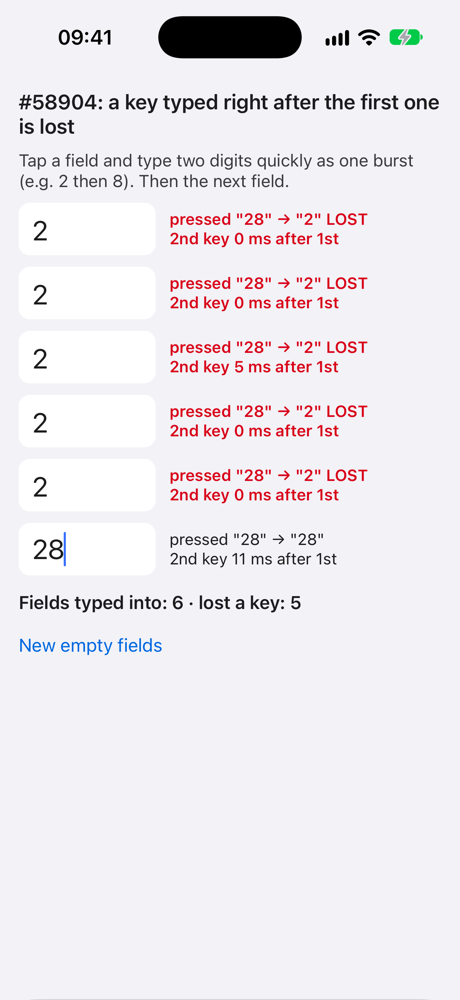
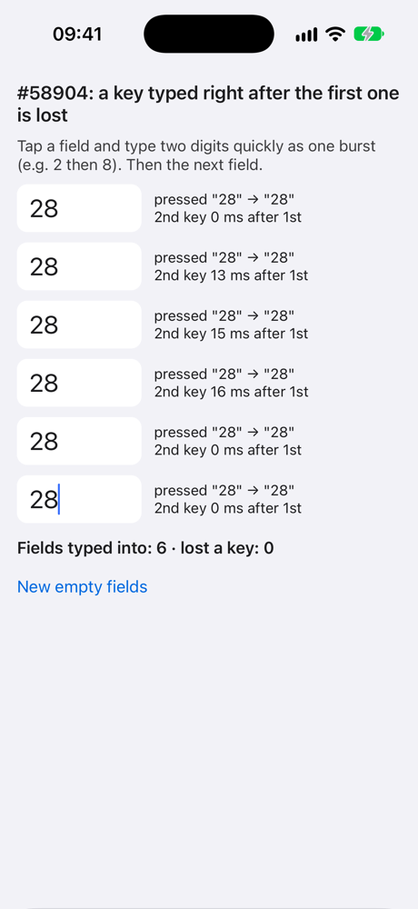

# Reproducer for react/react-native#58904

**[iOS][Fabric] `TextInput` drops a keystroke right after the first character typed into an empty field.**

Issue: https://github.com/react/react-native/issues/58904

Made from the [React Native reproducer template](https://github.com/react-native-community/reproducer-react-native): react-native 0.87.1 (latest), New Architecture, no extra dependencies. The issue was found on 0.86.3; `RCTTextInputComponentView.mm` is the same in 0.87.1 apart from one comment.

## What the app does

[`ReproducerApp/App.tsx`](ReproducerApp/App.tsx) renders six empty, uncontrolled `TextInput`s (`defaultValue=""`, `keyboardType="number-pad"`, a style with `fontSize`, `lineHeight` and `color`). Each row compares the keys `onKeyPress` reported with the characters that landed in the field. A lost key still fires `onKeyPress`, but never reaches the field.

## Steps

```sh
cd ReproducerApp
yarn install
cd ios && bundle install && bundle exec pod install && cd ..
yarn ios --mode Release   # Debug (`yarn start` + `yarn ios`) reproduces too, less often
```

1. In the iOS Simulator, use the Mac keyboard (I/O > Keyboard > Connect Hardware Keyboard).
2. Tap **Field 1** and type `2` then `8` quickly, as one burst. Then Field 2, and so on.
3. **Expected:** every row reads `pressed "28" → "28"`. **Actual:** some rows read `pressed "28" → "2" LOST`.

For another round, relaunch the app (the numbers below come from fresh launches; the **New empty fields** button also gives empty fields, but Fabric may hand them recycled native views).

| React Native 0.87.1 as is | With the suggested fix |
|---|---|
|  |  |

## Results

iPhone 17 Pro simulator, iOS 27.0, Xcode 27.0 (27A266a), 2026-10-07. A round = a fresh launch and six bursts of `28` sent through the simulator's hardware keyboard; JS received the second key 0-33 ms after the first.

| Build | Bursts | Lost a key |
|---|---|---|
| Release, React Native 0.87.1 as is | 18 | 9 (1, 3, 5 per round) |
| Release, with the suggested fix (`-ApplySuggestedFix YES`) | 18 | 0 |
| Debug, React Native 0.87.1 as is | 12 | 2 |

## The suggested fix, as a switch (off by default)

The issue suggests one more exception in `-[RCTTextInputComponentView _textOf:equals:]`: while the backed text input is the first responder, two strings with the same characters are equal, so the state round trip of the first character never calls `setAttributedText:` on a focused field.

[`AppDelegate.swift`](ReproducerApp/ios/ReproducerApp/AppDelegate.swift) can apply that change at runtime, so it can be compared without building React Native from source (the template links the prebuilt React Native core). It is OFF unless the app is launched with `-ApplySuggestedFix YES`:

```sh
xcrun simctl launch booted org.reactjs.native.example.ReproducerApp -ApplySuggestedFix YES
```

(or Xcode: Product > Scheme > Edit Scheme > Run > Arguments Passed On Launch). The device log then shows `[58904] suggested fix applied`.

## Changes from the template

- `ReproducerApp/App.tsx`: the reproducer.
- `ReproducerApp/ios/ReproducerApp/AppDelegate.swift`: the optional switch above, and a `SceneDelegate`.
- `ReproducerApp/ios/ReproducerApp/Info.plist`: `UIApplicationSceneManifest`.

The scene change is not part of the bug: the template creates its window in the app delegate, and an app built with the iOS 27 SDK that does not adopt the UIScene life cycle stops at launch on iOS 27 (Apple TN3187). The `SceneDelegate` only creates the window and starts React Native in it.
